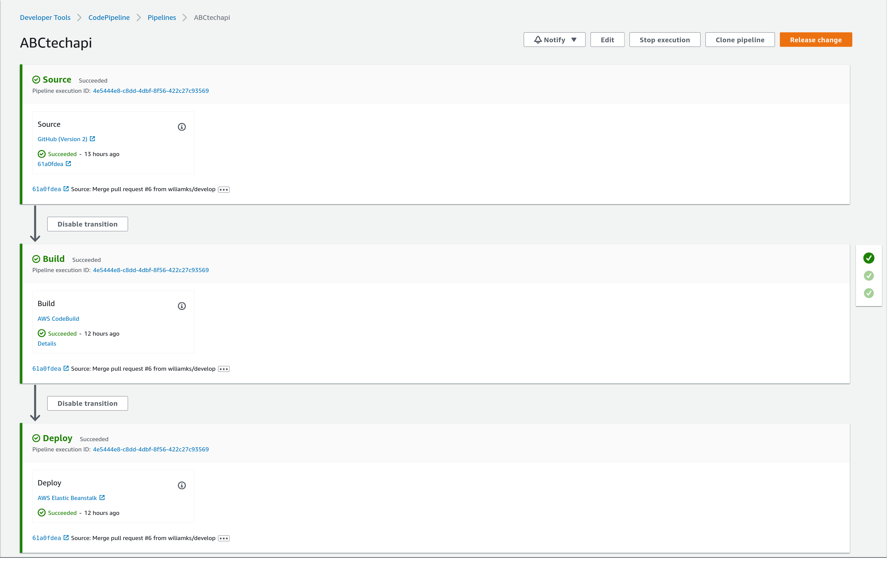

# 9aojo-abctechapi [](https://github.com/wiliamks/9aojo-abctechapi/actions/workflows/main.yml)
Solution Sprint da Fase 3 do MBA em Engenharia de Software na FIAP.

## Endpoints:
URL: [https://www.9aojo-abctech.dev.br](https://www.9aojo-abctech.dev.br)

| Verbo | Endpoint                          | Autenticação | Descrição                                |
|-------|-----------------------------------|--------------|------------------------------------------|
| GET   | /version                          | Não          | Retorna versão da API                    |
| GET   | /api/assistance                   | Sim          | Retorna todas as assitências disponíveis |
| GET   | /api/order/operator/{operator_id} | Sim          | Retorna todas as ordens do operador      |
| POST  | /auth/signup                      | Não          | Cadastra o operador                      |
| POST  | /auth/signin                      | Não          | Faz login do operador                    |
| POST  | /api/auth/signout                 | Sim          | Faz logout do operador                   |
| POST  | /api/order                        | Sim          | Cria uma nova ordem para o operador      |

Ao fazer o login, o client recebe um token no corpo e nos cookies da resposta que deve ser usado nas requests seguintes ou como cookie ou no header ```authorization```.

Documentos no Insomnia:
- [json](documents/ABC-Tech-API.json)
- [har](documents/ABC-Tech-API.har)

Obs: A API é criada com o usuário ````Fiap```` com a senha ```1234```

### Dependências
- JDK 11
- Kotlin 1.7.20
- Gradle 7.5.1
- MySQL 8.0

### Configuração
O projeto depende das variáveis de ambiente: ```JDBC_CONNECTION_STRING```, ```RDS_USERNAME``` e ```RDS_PASSWORD```, que representam respectivamente a url, o usuário e a senha pra conectar no MySql.
Antes de iniciar o projeto será necessário criar a database no banco de dados.

### Comandos
#### Para rodar o projeto:
```shell
./gradlew bootRun
```
Ou com docker compose:
```shell
docker-compose up
```

#### Rodar os testes
```shell
./gradlew test
```

#### Verificar porcentagem de cobertura dos testes
```shell
./gradlew jacocoTestCoverageVerification
```

#### Lint Check
```shell
./gradlew lint
```

#### Gerar arquivo WAR
```shell
./gradlew generateArtifact
```


### Pipeline na AWS


